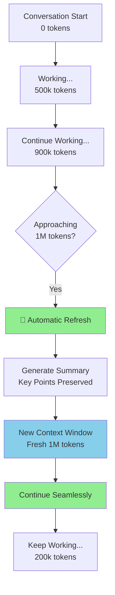
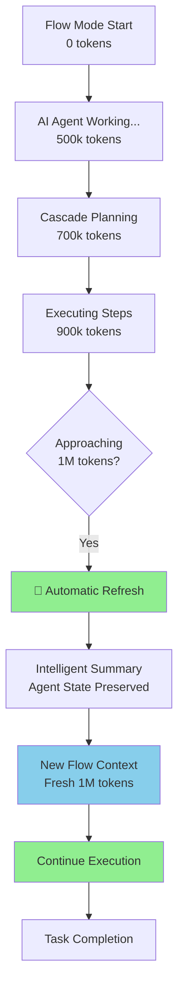
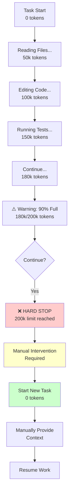
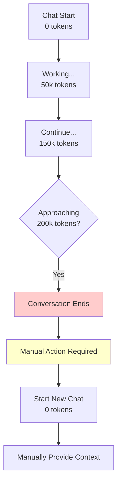
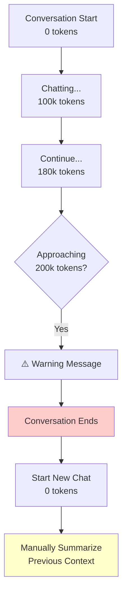

# AI Coding Assistants - Token Limit Comparison (Claude Sonnet 4.5)

## 🎯 Overview: Claude Sonnet 4.5 Across Different Tools

This comparison focuses specifically on how each tool handles **Claude Sonnet 4.5** and what happens when you hit token limits.

---

## 📊 Quick Comparison Table

| Tool | Max Context with Claude | Auto-Refresh | Context Preservation | Cost Model | What Happens at Limit |
|------|------------------------|--------------|---------------------|------------|----------------------|
| **Cursor** | 1,000,000 tokens (Sonnet 4.5) | ✅ Yes | Excellent | Subscription | Seamless continuation |
| **Windsurf** | 1,000,000 tokens (Sonnet 4.5) | ✅ Yes | Excellent | Subscription | Seamless continuation |
| **Cline** | 200,000 tokens (Sonnet 4.5) | ❌ No | Manual | BYOK (API) | Hard stop, new task |
| **GitHub Copilot** | 200,000 tokens (Sonnet 4) | ❌ No | Manual | Subscription | Hard stop, new chat |
| **Claude Code** | 200,000 tokens (Sonnet 4.5) | ❌ No | Manual | Subscription | Hard stop, new conversation |

---

## 🔍 Detailed Analysis by Tool

---

## 1️⃣ Cursor

### **Token Limits**
```
Model: Claude Sonnet 4.5
Context Window: 1,000,000 tokens
Effective Usage: ~950,000 tokens (buffer for responses)
```

### **What Happens at Token Limit**



### **Behavior**
```
Token Usage: 990,000 / 1,000,000

🔄 AUTOMATIC REFRESH TRIGGERED

Preserving:
✅ TODO list items
✅ Current task context
✅ Key architectural decisions
✅ Files being worked on
✅ Recent changes summary

Generating summary...
Creating new context window...

✅ REFRESH COMPLETE
New Token Budget: 1,000,000 tokens
You can continue working!
```

### **User Experience**
```
You: "Migrate all 27 servlets to Spring Boot"

[Working... 200k tokens]
[Working... 500k tokens]
[Working... 800k tokens]
[Working... 990k tokens]

🔄 [Automatic refresh - you barely notice]

[Working... 100k tokens in new context]
[Working... 300k tokens]
[Completed!]

Total: Used 2 context windows seamlessly
```

### **Pros & Cons**

✅ **Pros:**
- Largest context window (1M tokens)
- Automatic refresh
- No manual intervention
- Excellent context preservation
- Can handle massive codebases
- Seamless multi-phase projects

❌ **Cons:**
- Subscription required ($20/month Pro)
- Proprietary (not open source)
- Must use Cursor IDE (can't use VS Code)
- Limited to 500 premium requests/month on Pro

### **Best For:**
- Large codebase analysis
- Long refactoring sessions
- Comprehensive documentation generation
- Multi-phase migrations
- Exploratory coding

---

## 2️⃣ Windsurf (by Codeium)

### **Token Limits**
```
Model: Claude Sonnet 4.5 (via Codeium)
Context Window: 1,000,000 tokens
Effective Usage: ~950,000 tokens
```

### **What Happens at Token Limit**



### **Behavior**
```
Flow Mode Active
Token Usage: 985,000 / 1,000,000

🔄 CONTEXT REFRESH INITIATED

Windsurf Agent Status:
✅ Current cascade plan preserved
✅ Completed steps saved
✅ Pending actions queued
✅ Code changes tracked
✅ Terminal history maintained

Refreshing context...

✅ FLOW RESUMED
New Token Budget: 1,000,000 tokens
Agent continues execution...
```

### **User Experience**
```
You: "Migrate entire application to microservices"

Windsurf Cascade:
├─ Step 1: Analyze monolith ✅ (150k tokens)
├─ Step 2: Design services ✅ (200k tokens)
├─ Step 3: Extract auth service ✅ (250k tokens)
├─ Step 4: Extract booking service ⏳ (300k tokens)
│   └─ [Context approaching limit...]
│
🔄 [Automatic refresh]
│
├─ Step 5: Extract flight service ✅ (200k tokens)
├─ Step 6: Setup API gateway ✅ (150k tokens)
└─ Step 7: Deploy & test ✅ (200k tokens)

Total: Completed across 2 context windows
       Agent maintained full task awareness
```

### **Unique Features**

**Cascade Planning:**
```
Windsurf creates a plan before executing:

📋 CASCADE PLAN
├─ Analyze current architecture
├─ Identify service boundaries
├─ Extract authentication service
│   ├─ Create new project
│   ├─ Move auth code
│   ├─ Setup database
│   └─ Create API endpoints
├─ Extract booking service
└─ ... (continues)

This plan persists across context refreshes!
```

**Flow Mode:**
```
Windsurf's "Flow" = Continuous AI assistance
- Watches your edits
- Suggests improvements
- Auto-completes code
- Maintains context across sessions

Even after context refresh:
✅ Flow state preserved
✅ Suggestions continue
✅ No interruption
```

### **Pros & Cons**

✅ **Pros:**
- 1M token context (same as Cursor)
- Automatic refresh with agent state preservation
- Cascade planning survives refreshes
- Flow mode for continuous assistance
- Can use with VS Code or Windsurf IDE
- More affordable ($10/month)
- Better multi-step task execution

❌ **Cons:**
- Newer tool (less mature)
- Smaller community
- Some features still in beta
- Occasional bugs in cascade mode

### **Best For:**
- Autonomous multi-step tasks
- Complex refactoring with many steps
- Projects requiring persistent planning
- Users who want agent-like behavior with large context

---

## 3️⃣ Cline (formerly Claude Dev)

### **Token Limits**
```
Model: Claude Sonnet 4.5 (via Anthropic API)
Context Window: 200,000 tokens ⚠️
Effective Usage: ~180,000 tokens (safety buffer)
```

**⚠️ Important:** Even though Claude Sonnet 4.5 supports 200k tokens via API, Cline does NOT get the 1M token context that Cursor/Windsurf have!

### **What Happens at Token Limit**



### **Behavior**
```
Task: Migrate servlets to Spring Boot
Token Usage: 195,000 / 200,000

⚠️ WARNING: Context window is 97% full

Cline: "I'm approaching the context limit. 
        I recommend we complete the current 
        servlet migration and start a new 
        task for the remaining servlets."

You: "Continue with one more servlet"

❌ ERROR: Context window exceeded (200,000 tokens)

┌─────────────────────────────────────┐
│ Cannot continue this conversation   │
│                                     │
│ Options:                            │
│ [Start New Task]                    │
│ [Export Conversation]               │
└─────────────────────────────────────┘
```

### **User Experience**
```
Task 1: "Analyze codebase and plan migration"
├─ Read 27 files (80k tokens)
├─ Analyze architecture (40k tokens)
├─ Create migration plan (30k tokens)
└─ Status: ✅ Complete (150k/200k used)

Task 2: "Migrate LoginManager and SearchFlights"
├─ Context from Task 1 (manual, 20k tokens)
├─ Migrate LoginManager (50k tokens)
├─ Test LoginManager (30k tokens)
├─ Migrate SearchFlights (50k tokens)
├─ Test SearchFlights (30k tokens)
└─ Status: ✅ Complete (180k/200k used)

Task 3: "Migrate BookFlight and ChooseFlight"
├─ Context from Tasks 1-2 (manual, 25k tokens)
├─ Migrate BookFlight (50k tokens)
├─ Test BookFlight (30k tokens)
├─ Migrate ChooseFlight (50k tokens)
└─ Status: ⚠️ Stopped at 155k (approaching limit)

Task 4: "Complete ChooseFlight and migrate CurrentBooking"
├─ Context (manual, 20k tokens)
├─ Complete ChooseFlight (30k tokens)
├─ Migrate CurrentBooking (50k tokens)
├─ Test CurrentBooking (30k tokens)
└─ Status: ✅ Complete (130k/200k used)

Total: 4 separate tasks required
       Manual context transfer each time
```

### **Workarounds**

**1. Task Splitting Strategy:**
```
✅ Good Task Size (stays under 200k):
- "Migrate 2-3 servlets with tests"
- "Refactor authentication module"
- "Add validation to booking flow"

❌ Bad Task Size (will hit limit):
- "Migrate all 27 servlets"
- "Refactor entire application"
- "Add comprehensive tests to everything"
```

**2. External Context Management:**
```
Create: migration-context.md

## Completed
- ✅ LoginManager → AuthController
- ✅ SearchFlights → FlightSearchController

## Patterns Established
- Use @RestController
- Return ResponseEntity<T>
- Use @Autowired for dependencies

## Next Steps
- Migrate BookFlight
- Migrate ChooseFlight

Reference this in each new task!
```

**3. MCP Memory Server:**
```
Setup MCP (Model Context Protocol):
- Install memory server
- Configure in Cline settings
- Automatic context persistence

With MCP:
Task 1: [Cline stores context in memory]
Task 2: [Cline retrieves relevant context]
       "I see we're using @RestController pattern..."
```

### **Pros & Cons**

✅ **Pros:**
- BYOK (Bring Your Own Key) - pay only for usage
- Works in standard VS Code
- Very transparent (shows every action)
- High degree of control
- Open source
- Can use local models
- Active community

❌ **Cons:**
- **Only 200k token context** (5x smaller than Cursor/Windsurf)
- **No automatic refresh** (hard stop)
- **Manual context transfer** required
- More task management overhead
- Frequent task switches on large projects
- Higher cognitive load

### **Best For:**
- Task-based workflows
- Users who want full control
- BYOK cost optimization
- Working with existing VS Code setup
- Smaller, focused tasks

---

## 4️⃣ GitHub Copilot

### **Token Limits**
```
Model: Claude Sonnet 4 ✅ (Available)

Available Models:
- GPT-4 Turbo (128k tokens)
- GPT-4o (128k tokens)
- Claude Sonnet 4 (200k tokens)

Context Window: 200,000 tokens (Claude Sonnet 4)
```

### **Claude Sonnet 4 Support**
```
✅ AVAILABLE

GitHub Copilot supports:
1. OpenAI models (GPT-4, GPT-4o)
2. Claude Sonnet 4 (200k context)

Note: Claude Sonnet 4.5 with 1M context is NOT available
      Only the 200k token version is supported
```

### **What Happens at Token Limit (Claude Sonnet 4)**



### **Behavior**
```
GitHub Copilot Chat
Model: Claude Sonnet 4
Token Usage: 190,000 / 200,000

⚠️ Context limit approaching

You: "Continue with next servlet"

❌ This conversation is too long.
   Please start a new chat.

[New Chat] button appears
```

### **User Experience**
```
Chat 1: "Analyze this codebase"
├─ Reads files (80k tokens)
├─ Provides analysis (50k tokens)
└─ Status: ✅ Complete (130k/200k used)

Chat 2: "Create migration plan"
├─ Manual context: "We analyzed 27 servlets..." (15k tokens)
├─ Creates plan (40k tokens)
└─ Status: ✅ Complete (55k/200k used)

Chat 3: "Migrate LoginManager and SearchFlights"
├─ Manual context (15k tokens)
├─ Generates code for both (80k tokens)
└─ Status: ✅ Complete (95k/200k used)

Total: Multiple chats required (similar to Cline)
       200k context (same as Cline, Claude.ai)
       Manual context transfer needed
```

### **Pros & Cons**

✅ **Pros:**
- **Supports Claude Sonnet 4** (200k context)
- Excellent autocomplete (best in class)
- Deep GitHub integration
- Good for quick questions
- Fast inline suggestions
- Works in multiple IDEs (VS Code, JetBrains, etc.)
- Affordable ($10/month)
- Multiple model choices (GPT-4, Claude)

❌ **Cons:**
- **No Claude Sonnet 4.5 (1M context)** - only 200k version
- No automatic refresh
- Manual context management
- Chat is secondary feature (autocomplete is primary)
- Not optimized for large refactoring
- Context limit same as Cline (200k)

### **Best For:**
- Code completion while typing (⭐⭐⭐⭐⭐)
- Quick inline suggestions
- Small to medium code snippets
- GitHub workflow integration
- Users who want Claude + great autocomplete
- NOT ideal for large-scale refactoring (use Cursor/Windsurf instead)

---

## 5️⃣ Claude Code (Official Anthropic VS Code Extension)

### **Token Limits**
```
Model: Claude Sonnet 4.5 ✅
Context Window: 200,000 tokens
Effective Usage: ~180,000 tokens
Platform: VS Code Extension (Official)
```

### **What Happens at Token Limit**



### **Behavior**
```
Claude Code (VS Code Extension)
Model: Claude Sonnet 4.5
Token Usage: 195,000 / 200,000

⚠️ Context window is 97% full

You: "Continue with the migration"

❌ Context limit reached (200,000 tokens)
   Please start a new conversation.

[New Conversation] button in sidebar
```

### **User Experience**
```
Conversation 1: "Analyze codebase and create plan"
├─ Claude Code reads files from workspace (80k tokens)
├─ Analyzes architecture (50k tokens)
├─ Creates migration plan (40k tokens)
└─ Status: ✅ Complete (170k/200k)

Conversation 2: "Migrate LoginManager and SearchFlights"
├─ Manual context: "Following the plan from Conv 1..." (20k tokens)
├─ Reads relevant files (40k tokens)
├─ Generates Spring Boot code (60k tokens)
├─ Creates tests (40k tokens)
└─ Status: ✅ Complete (160k/200k)

Conversation 3: "Migrate BookFlight and ChooseFlight"
├─ Manual context (20k tokens)
├─ Reads files (40k tokens)
├─ Generates code (60k tokens)
└─ Status: ✅ Complete (120k/200k)

Total: Multiple conversations required (similar to Cline)
       Has file system access
       Can read/write files
       VS Code integration
```

### **Features for Coding**

✅ **Available:**
- File system access (read/write)
- Workspace awareness
- Multi-file editing
- Code generation
- VS Code integration
- Direct file manipulation
- Context from open files

❌ **Limitations:**
- No terminal execution
- No autocomplete
- 200k token limit (not 1M)
- No automatic refresh
- Manual context management
- No agent/autonomous mode

### **Pros & Cons**

✅ **Pros:**
- **Official Anthropic extension**
- Access to Claude Sonnet 4.5
- File system access (read/write)
- VS Code integration
- Multi-file editing
- Workspace awareness
- Free tier available
- Direct from Anthropic (no middleman)

❌ **Cons:**
- **Only 200k tokens** (not 1M like Cursor/Windsurf)
- No automatic refresh
- No terminal execution
- No autocomplete
- No agent/autonomous mode
- Manual context management
- Requires Claude.ai subscription

### **Best For:**
- Users who want official Anthropic experience
- VS Code users who prefer native Claude
- Code generation and refactoring
- Multi-file editing tasks
- Alternative to Cline with official support
- NOT for large-scale refactoring (use Cursor/Windsurf)

---

## 📈 Token Limit Comparison Chart

```
Context Window Size (Claude Models):

Cursor       ████████████████████ 1,000,000 tokens (Sonnet 4.5)
Windsurf     ████████████████████ 1,000,000 tokens (Sonnet 4.5)
Cline        ████ 200,000 tokens (Sonnet 4.5)
Copilot      ████ 200,000 tokens (Sonnet 4)
Claude Code  ████ 200,000 tokens (Sonnet 4.5)

Auto-Refresh Capability:

Cursor       ✅ Seamless automatic refresh
Windsurf     ✅ Seamless automatic refresh
Cline        ❌ Hard stop, manual new task
Copilot      ❌ Hard stop, manual new chat
Claude Code  ❌ Hard stop, manual new conversation
```

---

## 🎯 Real-World Scenario: Migrate Flight Booking System

### **Task: Migrate all 27 servlets to Spring Boot**

Estimated token usage: ~800,000 tokens total
- Analyze codebase: 150k tokens
- Create plan: 100k tokens
- Migrate 27 servlets: 450k tokens (avg 16k each)
- Generate tests: 100k tokens

---

### **With Cursor:**
```
✅ Single Conversation

Timeline:
0:00 - Start analysis
0:05 - Complete analysis (150k tokens)
0:10 - Create migration plan (250k tokens)
0:30 - Migrate servlets 1-10 (450k tokens)
1:00 - Migrate servlets 11-20 (650k tokens)
1:30 - Migrate servlets 21-27 (800k tokens)
1:45 - Generate tests (900k tokens)
2:00 - Complete documentation (950k tokens)

✅ COMPLETE in one conversation
   No interruptions
   Full context maintained
```

---

### **With Windsurf:**
```
✅ Single Flow Session

Cascade Plan Created:
├─ Analyze architecture ✅
├─ Design Spring Boot structure ✅
├─ Migrate authentication servlets ✅
├─ Migrate customer servlets ✅
├─ Migrate admin servlets ✅
├─ Migrate manager servlets ✅
├─ Generate comprehensive tests ✅
└─ Verify and deploy ✅

Timeline:
0:00 - Create cascade plan (50k tokens)
0:10 - Analyze & design (200k tokens)
0:40 - Migrate servlets 1-15 (600k tokens)
1:20 - Migrate servlets 16-27 (950k tokens)
🔄 [Auto-refresh at 1M tokens]
1:25 - Generate tests (200k tokens in new context)
1:45 - Complete verification (350k tokens)

✅ COMPLETE across 2 context windows
   Cascade plan preserved
   Seamless continuation
```

---

### **With Cline:**
```
❌ Requires Multiple Tasks

Task 1: "Analyze codebase and create plan"
├─ Analyze 27 servlets (120k tokens)
├─ Create migration plan (50k tokens)
└─ ✅ Complete (170k/200k)

Task 2: "Migrate authentication servlets"
├─ Context from Task 1 (manual, 20k tokens)
├─ Migrate LoginManager (40k tokens)
├─ Migrate LogoutManager (40k tokens)
├─ Test both (50k tokens)
└─ ✅ Complete (150k/200k)

Task 3: "Migrate customer servlets (part 1)"
├─ Context (20k tokens)
├─ Migrate SearchFlights (40k tokens)
├─ Migrate ChooseFlight (40k tokens)
├─ Test both (50k tokens)
└─ ✅ Complete (150k/200k)

Task 4: "Migrate customer servlets (part 2)"
├─ Context (20k tokens)
├─ Migrate BookFlight (40k tokens)
├─ Migrate CurrentBooking (40k tokens)
├─ Test both (50k tokens)
└─ ✅ Complete (150k/200k)

Task 5-10: [Continue pattern for remaining servlets]

Total: 10+ separate tasks
       Manual context transfer each time
       3-4 hours of work
```

---

### **With GitHub Copilot:**
```
⚠️ Challenging but Possible

With Claude Sonnet 4 (200k context):

Task 1: "Analyze codebase and plan migration"
├─ Analyze 27 servlets (100k tokens)
├─ Create migration plan (50k tokens)
└─ ✅ Complete (150k/200k)

Task 2: "Migrate authentication servlets"
├─ Context from Task 1 (manual, 20k tokens)
├─ Migrate LoginManager (40k tokens)
├─ Migrate LogoutManager (40k tokens)
├─ Test both (40k tokens)
└─ ✅ Complete (140k/200k)

Task 3-8: [Continue pattern for remaining servlets]

Total: 8-10 separate chats required
       Similar to Cline experience
       200k context (same as Cline)
       
Advantage over Cline:
✅ Best-in-class autocomplete while coding
✅ GitHub integration
✅ Multi-IDE support

Disadvantage vs Cursor/Windsurf:
❌ 5x smaller context (200k vs 1M)
❌ No automatic refresh
❌ Manual context management
```

---

### **With Claude Code:**
```
⚠️ Challenging but Doable

With Claude Sonnet 4.5 (200k context) + VS Code:

Conversation 1: "Analyze codebase and create plan"
├─ Read all 27 servlets (100k tokens)
├─ Create migration plan (50k tokens)
└─ ✅ Complete (150k/200k)

Conversation 2: "Migrate authentication servlets"
├─ Context from Conv 1 (manual, 20k tokens)
├─ Migrate LoginManager (40k tokens)
├─ Migrate LogoutManager (40k tokens)
├─ Write files directly (40k tokens)
└─ ✅ Complete (140k/200k)

Conversation 3-8: [Continue pattern for remaining servlets]

Total: 8-10 separate conversations
       Similar to Cline experience
       200k context (same as Cline)
       
Advantage over Cline:
✅ Official Anthropic extension
✅ Direct file read/write
✅ Integrated with VS Code

Disadvantage vs Cursor/Windsurf:
❌ 5x smaller context (200k vs 1M)
❌ No automatic refresh
❌ No terminal execution
❌ No autocomplete
```

---

## 💰 Cost Comparison (Claude Models)

### **Individual/Pro Plans:**

| Tool | Individual Plan | Context | Monthly Limit | Best For |
|------|----------------|---------|---------------|----------|
| **Cursor Pro** | $20/month | 1M tokens | 500 premium requests | Large context needs |
| **Windsurf Pro** | $10/month | 1M tokens | Unlimited | Best value |
| **Cline** | BYOK (pay-as-you-go) | 200k tokens | Based on API usage | Variable usage |
| **GitHub Copilot** | $10/month | 200k tokens | Unlimited | Autocomplete focus |
| **Claude Code** | $20/month (via Claude.ai Pro) | 200k tokens | Limited messages | Official Anthropic |

### **Enterprise/Team Plans:**

| Tool | Enterprise Plan | Per User/Month | Features | Minimum Seats |
|------|----------------|----------------|----------|---------------|
| **Cursor Business** | $40/user/month | Billed annually | • Centralized billing<br>• Admin dashboard<br>• Usage analytics<br>• Priority support<br>• Custom models<br>• SSO (coming) | 5+ users |
| **Windsurf Teams** | $15/user/month | Flexible billing | • Team collaboration<br>• Shared context<br>• Admin controls<br>• Usage tracking<br>• Priority support | 3+ users |
| **Cline** | Self-hosted BYOK | Variable | • Use own API keys<br>• Full control<br>• No per-seat cost<br>• Pay only API usage<br>• Unlimited users | No minimum |
| **GitHub Copilot Business** | $19/user/month | Flexible billing | • Organization license<br>• Policy management<br>• Usage insights<br>• IP indemnity<br>• Multi-IDE support | 1+ users |
| **GitHub Copilot Enterprise** | $39/user/month | Annual contract | • Everything in Business<br>• Fine-tuned models<br>• Custom knowledge base<br>• Advanced security<br>• Dedicated support | 50+ users |
| **Claude Code (Team)** | $30/user/month | Min 5 users | • Higher limits<br>• Shared workspaces<br>• Admin console<br>• Priority access<br>• Official Anthropic | 5+ users |

### **Annual Cost Comparison (10-person team):**

| Tool | Annual Cost (10 users) | Cost per User | Context Size | Notes |
|------|------------------------|---------------|--------------|-------|
| **Windsurf Teams** | **$1,800/year** | $15/month | 1M tokens | 🏆 Best value for teams |
| **GitHub Copilot Business** | **$2,280/year** | $19/month | 200k tokens | Good for GitHub orgs |
| **Cline (BYOK)** | **~$2,160/year** | ~$18/month | 200k tokens | Variable, API costs only |
| **Claude Code (Team)** | **$3,600/year** | $30/month | 200k tokens | Official Anthropic |
| **Cursor Business** | **$4,800/year** | $40/month | 1M tokens | Premium features |
| **GitHub Copilot Enterprise** | **$4,680/year** | $39/month | 200k tokens | Large orgs only (50+ min) |

### **Cost Analysis by Use Case:**

#### **Startup (5 developers):**
```
Best Option: Windsurf Teams
Cost: $900/year ($15 × 5 × 12)
Why: 
✅ Lowest cost
✅ 1M context
✅ Full features
✅ No minimum seat requirement beyond 3

Alternative: GitHub Copilot Business
Cost: $1,140/year ($19 × 5 × 12)
Why:
✅ Great autocomplete
✅ GitHub integration
⚠️ Only 200k context
```

#### **Mid-size Company (25 developers):**
```
Best Option: Windsurf Teams
Cost: $4,500/year ($15 × 25 × 12)
Savings vs Cursor: $7,500/year

Alternative: GitHub Copilot Business
Cost: $5,700/year ($19 × 25 × 12)
Why:
✅ Enterprise features
✅ GitHub integration
✅ IP indemnity
```

#### **Enterprise (100+ developers):**
```
Option 1: Windsurf Teams
Cost: $18,000/year ($15 × 100 × 12)
Best for: Large context, autonomous coding

Option 2: GitHub Copilot Enterprise
Cost: $46,800/year ($39 × 100 × 12)
Best for: Custom models, advanced security

Option 3: Cline (BYOK)
Cost: ~$21,600/year (100 users × ~$18/month API)
Best for: Cost control, self-hosted needs

Savings (Windsurf vs Copilot Enterprise): $28,800/year
```

#### **Heavy API Usage (Individual):**
```
Light Usage (< 500k tokens/month):
1. Windsurf: $10/month ⭐ Best value
2. Cline: ~$9/month (BYOK)
3. GitHub Copilot: $10/month
4. Cursor: $20/month

Heavy Usage (2M+ tokens/month):
1. Windsurf: $10/month ⭐ Best value (unlimited)
2. Cursor: $20/month (may need Business at $40)
3. GitHub Copilot: $10/month (unlimited)
4. Cline: ~$36/month (BYOK)
```

### **Hidden Costs to Consider:**

#### **Cursor:**
```
Potential Additional Costs:
- Premium requests limit (500/month on Pro)
- Need Business plan for unlimited ($40/month)
- Custom models require Business plan
- No team collaboration on Pro plan

Real Cost for Heavy Users: $40/month (Business)
```

#### **Windsurf:**
```
Potential Additional Costs:
- None - truly unlimited on Pro plan
- Teams plan for collaboration ($15/user)

Real Cost: $10/month (stays consistent)
```

#### **Cline:**
```
Potential Additional Costs:
- Anthropic API costs (variable)
- Claude Sonnet 4.5: $3/$15 per 1M tokens
- Can spike with heavy usage
- Need to manage API keys

Real Cost: $10-50/month (depends on usage)
```

#### **GitHub Copilot:**
```
Potential Additional Costs:
- None for individuals ($10/month unlimited)
- Business features require Business plan ($19/user)
- Enterprise features require Enterprise ($39/user)
- Minimum 50 users for Enterprise

Real Cost: $10-39/month (depends on tier)
```

### **ROI Calculation Example:**

**Scenario: 10-developer team, 40 hours/week each**

Assuming AI coding assistant saves **2 hours/week per developer**:

```
Time Saved: 2 hours × 10 developers × 52 weeks = 1,040 hours/year
Average Developer Cost: $75/hour
Value Created: 1,040 × $75 = $78,000/year

Tool Costs:
- Windsurf Teams: $1,800/year → ROI: 4,233%
- GitHub Copilot Business: $2,280/year → ROI: 3,321%
- Cursor Business: $4,800/year → ROI: 1,525%

Conclusion: Even the most expensive option has massive ROI
```

### **Free Tiers & Trials:**

| Tool | Free Tier | Trial Period | Limitations |
|------|-----------|--------------|-------------|
| **Cursor** | ✅ Yes | 14 days Pro | 2,000 completions/month, 50 premium requests |
| **Windsurf** | ✅ Yes | 14 days Pro | Limited requests |
| **Cline** | ✅ Yes | N/A (BYOK) | Pay only for API usage |
| **GitHub Copilot** | ✅ Yes | 30 days | Full access during trial |
| **Claude.ai** | ✅ Yes | N/A | Limited messages/day |

### **Payment Flexibility:**

| Tool | Monthly | Annual | BYOK | Cancellation |
|------|---------|--------|------|--------------|
| **Cursor** | ✅ | ✅ (save 16%) | ❌ | Anytime |
| **Windsurf** | ✅ | ✅ | ❌ | Anytime |
| **Cline** | N/A | N/A | ✅ | Anytime (API) |
| **GitHub Copilot** | ✅ | ✅ | ❌ | Anytime |
| **Claude.ai** | ✅ | ✅ | ❌ | Anytime |

---

## 🏆 Final Recommendations

### **For Large Codebase Analysis & Refactoring:**
```
🥇 Cursor or Windsurf
   - 1M token context
   - Automatic refresh
   - Seamless experience
   - Best for: Comprehensive migrations
```

### **For Task-Based Development:**
```
🥇 Windsurf (if you want automation)
   - Cascade planning
   - Agent-like behavior
   - 1M context
   
🥈 Cline (if you want control)
   - High transparency
   - BYOK pricing
   - VS Code integration
```

### **For Quick Autocomplete:**
```
🥇 GitHub Copilot
   - Best autocomplete
   - Fast suggestions
   - NOT for large refactoring
```

### **For Code Review/Learning:**
```
🥇 Claude.ai
   - Good for explaining code
   - Paste snippets for review
   - NOT for active development
```

---

## 📊 Feature Matrix

| Feature | Cursor | Windsurf | Cline | Copilot | Claude Code |
|---------|--------|----------|-------|---------|-------------|
| **Claude Model** | Sonnet 4.5 | Sonnet 4.5 | Sonnet 4.5 | Sonnet 4 | Sonnet 4.5 |
| **Context Size** | 1M | 1M | 200k | 200k | 200k |
| **Auto-Refresh** | ✅ | ✅ | ❌ | ❌ | ❌ |
| **File Access** | ✅ | ✅ | ✅ | ✅ | ✅ |
| **Terminal Exec** | ✅ | ✅ | ✅ | Limited | ❌ |
| **Autocomplete** | ✅ | ✅ | ❌ | ✅✅✅ | ❌ |
| **Agent Mode** | ✅ | ✅✅ | ✅ | ❌ | ❌ |
| **IDE** | Cursor | Windsurf/VSC | VS Code | Multiple | VS Code |
| **Cost** | $20/mo | $10/mo | BYOK | $10/mo | $20/mo |
| **Best For** | Large context | Autonomous | Control | Autocomplete | Official |

---

## 🏢 Enterprise Features Comparison

### **Security & Compliance**

| Feature | Cursor | Windsurf | Cline | Copilot | Claude Code |
|---------|--------|----------|-------|---------|-------------|
| **SSO (SAML)** | 🔜 Coming | ❌ | Self-hosted | ✅ Business+ | ✅ Team+ |
| **SOC 2 Certified** | ✅ | 🔜 In progress | N/A (BYOK) | ✅ | ✅ |
| **GDPR Compliant** | ✅ | ✅ | N/A (BYOK) | ✅ | ✅ |
| **Data Residency** | US only | US only | Self-controlled | Global | US/EU |
| **On-Premise** | ❌ | ❌ | ✅ (self-host) | ❌ | ❌ |
| **Air-Gapped** | ❌ | ❌ | ✅ (local models) | ❌ | ❌ |
| **IP Indemnity** | ❌ | ❌ | N/A | ✅ Business+ | ❌ |
| **Code Not Used for Training** | ✅ | ✅ | ✅ | ✅ Business+ | ✅ |
| **Audit Logs** | ✅ Business | ✅ Teams | Self-managed | ✅ Business+ | ✅ Team+ |
| **2FA/MFA** | ✅ | ✅ | Via provider | ✅ | ✅ |

### **Administration & Management**

| Feature | Cursor | Windsurf | Cline | Copilot | Claude Code |
|---------|--------|----------|-------|---------|-------------|
| **Admin Dashboard** | ✅ Business | ✅ Teams | N/A | ✅ Business+ | ✅ Team+ |
| **Usage Analytics** | ✅ Business | ✅ Teams | Self-tracked | ✅ Business+ | ✅ Team+ |
| **User Management** | ✅ Business | ✅ Teams | N/A | ✅ Business+ | ✅ Team+ |
| **Role-Based Access** | ✅ Business | ✅ Teams | N/A | ✅ Enterprise | ✅ Team+ |
| **Policy Controls** | Limited | Limited | N/A | ✅ Business+ | Limited |
| **Centralized Billing** | ✅ Business | ✅ Teams | Per-user API | ✅ Business+ | ✅ Team+ |
| **License Management** | ✅ Business | ✅ Teams | N/A | ✅ Business+ | ✅ Team+ |
| **API Access** | Limited | Limited | Full (BYOK) | ✅ Enterprise | Via Claude API |

### **Support & SLA**

| Feature | Cursor | Windsurf | Cline | Copilot | Claude Code |
|---------|--------|----------|-------|---------|-------------|
| **Priority Support** | ✅ Business | ✅ Teams | Community | ✅ Business+ | ✅ Team+ |
| **Dedicated Support** | ❌ | ❌ | ❌ | ✅ Enterprise | ✅ Enterprise |
| **SLA Guarantee** | ❌ | ❌ | N/A | ✅ Enterprise | ✅ Enterprise |
| **24/7 Support** | ❌ | ❌ | ❌ | ✅ Enterprise | ✅ Enterprise |
| **Slack Channel** | ❌ | ❌ | Community | ✅ Enterprise | ❌ |
| **CSM (Customer Success)** | ❌ | ❌ | ❌ | ✅ Enterprise | ✅ Enterprise |
| **Training Sessions** | ❌ | ❌ | ❌ | ✅ Enterprise | ✅ Enterprise |
| **Onboarding** | Self-service | Self-service | Self-service | ✅ Enterprise | ✅ Enterprise |

### **Customization & Integration**

| Feature | Cursor | Windsurf | Cline | Copilot | Claude Code |
|---------|--------|----------|-------|---------|-------------|
| **Custom Models** | ✅ Business | ❌ | ✅ (BYOK) | ✅ Enterprise | ❌ |
| **Fine-Tuning** | ❌ | ❌ | Via API | ✅ Enterprise | ❌ |
| **Custom Knowledge Base** | ❌ | ❌ | Via prompts | ✅ Enterprise | ❌ |
| **API Integration** | Limited | Limited | Full | ✅ | Via Claude API |
| **Webhooks** | ❌ | ❌ | N/A | ✅ Enterprise | ❌ |
| **CI/CD Integration** | Limited | Limited | ✅ | ✅ | Limited |
| **IDE Extensions** | Cursor only | Windsurf/VSC | VS Code | Multiple | VS Code |
| **Custom Prompts** | ✅ | ✅ | ✅ | Limited | ✅ |

### **Collaboration Features**

| Feature | Cursor | Windsurf | Cline | Copilot | Claude Code |
|---------|--------|----------|-------|---------|-------------|
| **Shared Workspaces** | ❌ | ✅ Teams | N/A | ❌ | ✅ Team+ |
| **Team Chat History** | ❌ | ✅ Teams | N/A | ❌ | ✅ Team+ |
| **Code Snippets Sharing** | ❌ | ✅ Teams | Manual | ❌ | ✅ Team+ |
| **Shared Context** | ❌ | ✅ Teams | N/A | ❌ | ✅ Team+ |
| **Team Templates** | ❌ | ✅ Teams | N/A | ❌ | ✅ Team+ |
| **Collaborative Editing** | ❌ | ❌ | N/A | ❌ | ❌ |

### **Enterprise Scoring (Out of 10)**

| Tool | Security | Admin | Support | Customization | Collaboration | Total | Grade |
|------|----------|-------|---------|---------------|---------------|-------|-------|
| **GitHub Copilot Enterprise** | 10/10 | 10/10 | 10/10 | 9/10 | 6/10 | **45/50** | A |
| **Cursor Business** | 8/10 | 9/10 | 7/10 | 8/10 | 4/10 | **36/50** | B+ |
| **Claude Code Team** | 9/10 | 8/10 | 8/10 | 5/10 | 7/10 | **37/50** | B+ |
| **Windsurf Teams** | 7/10 | 8/10 | 6/10 | 5/10 | 8/10 | **34/50** | B |
| **Cline (BYOK)** | 10/10 | 3/10 | 3/10 | 10/10 | 2/10 | **28/50** | C+ |

**Key Insights:**
- **GitHub Copilot Enterprise**: Best for large enterprises needing full compliance, SLA, and IP indemnity
- **Cursor/Claude Code**: Good balance of features and security for mid-size companies
- **Windsurf**: Best value with decent enterprise features, growing fast
- **Cline**: Best for companies with strict data control requirements (on-premise, air-gapped)

---

## 🎯 Bottom Line

### **If You Need Claude Sonnet 4.5 with Maximum Context:**

**🥇 Tier 1: Cursor or Windsurf**
- Both offer 1M token context
- Both have automatic refresh
- Both provide seamless experience
- **Choose Windsurf** if you want better agent behavior + lower cost ($10 vs $20)
- **Choose Cursor** if you want more mature tool + better autocomplete

**🥈 Tier 2: Cline**
- Only 200k tokens (5x smaller)
- Manual task management required
- Good for task-based work
- Best if you want BYOK control

**🥉 Tier 3: Claude.ai**
- 200k tokens
- No IDE integration
- Only for code review/learning
- Not for active development

**❌ Not Applicable: GitHub Copilot**
- Doesn't support Claude Sonnet 4.5
- Use for autocomplete only

---

## 🚀 My Recommendation for Your Flight Booking System

Given your project (27 servlets, large migration):

**Best Choice: Windsurf or Cursor**

Why?
✅ 1M token context = analyze entire codebase
✅ Auto-refresh = complete migration in 1-2 sessions
✅ No manual context management
✅ Can handle comprehensive refactoring

**Windsurf edges out** because:
- $10/month vs $20/month
- Better cascade planning for multi-step migrations
- Agent mode is more autonomous
- Flow mode maintains context across sessions

**Second Choice: Cline**
- If you're on a budget (BYOK)
- If you want maximum control
- Be prepared for 8-10 separate tasks
- Manual context management required

---

Would you like me to demonstrate how the migration would work specifically in Windsurf vs Cursor vs Cline?

