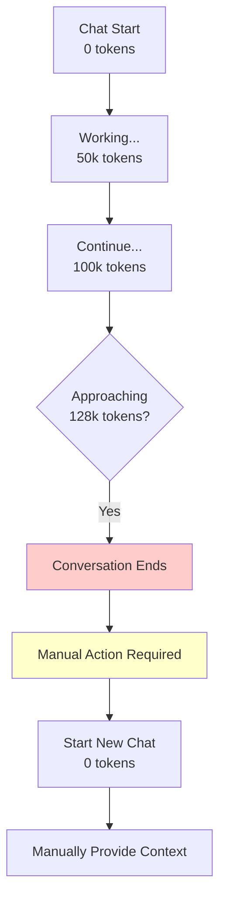

```mermaid
graph TB
    Start[Conversation Start<br/>0 tokens] --> Work[Working...<br/>500k tokens]
    Work --> MoreWork[Continue Working...<br/>900k tokens]
    MoreWork --> Limit{Approaching<br/>1M tokens?}
    Limit -->|Yes| AutoRefresh[🔄 Automatic Refresh]
    AutoRefresh --> Summary[Generate Summary<br/>Key Points Preserved]
    Summary --> NewContext[New Context Window<br/>Fresh 1M tokens]
    NewContext --> Continue[Continue Seamlessly]
    Continue --> Work2[Keep Working...<br/>200k tokens]
    
    style AutoRefresh fill:#90EE90
    style NewContext fill:#87CEEB
    style Continue fill:#90EE90
```

```mermaid
graph TB
    Start[Flow Mode Start<br/>0 tokens] --> Work[AI Agent Working...<br/>500k tokens]
    Work --> Cascade[Cascade Planning<br/>700k tokens]
    Cascade --> Execute[Executing Steps<br/>900k tokens]
    Execute --> Limit{Approaching<br/>1M tokens?}
    Limit -->|Yes| AutoRefresh[🔄 Automatic Refresh]
    AutoRefresh --> Summary[Intelligent Summary<br/>Agent State Preserved]
    Summary --> NewFlow[New Flow Context<br/>Fresh 1M tokens]
    NewFlow --> Continue[Continue Execution]
    Continue --> Complete[Task Completion]
    
    style AutoRefresh fill:#90EE90
    style NewFlow fill:#87CEEB
    style Continue fill:#90EE90
```

```mermaid
graph TB
    Start[Task Start<br/>0 tokens] --> Work[Reading Files...<br/>50k tokens]
    Work --> Edit[Editing Code...<br/>100k tokens]
    Edit --> Test[Running Tests...<br/>150k tokens]
    Test --> More[Continue...<br/>180k tokens]
    More --> Warning[⚠️ Warning: 90% Full<br/>180k/200k tokens]
    Warning --> Limit{Continue?}
    Limit -->|Yes| Error[❌ HARD STOP<br/>200k limit reached]
    Error --> Manual[Manual Intervention<br/>Required]
    Manual --> NewTask[Start New Task<br/>0 tokens]
    NewTask --> Context[Manually Provide<br/>Context]
    Context --> Resume[Resume Work]
    
    style Error fill:#ffcccc
    style Manual fill:#ffffcc
    style NewTask fill:#ccffcc
```

```mermaid
graph TB
    Start[Conversation Start<br/>0 tokens] --> Work[Chatting...<br/>100k tokens]
    Work --> More[Continue...<br/>180k tokens]
    More --> Limit{Approaching<br/>200k tokens?}
    Limit -->|Yes| Warning[⚠️ Warning Message]
    Warning --> Stop[Conversation Ends]
    Stop --> NewChat[Start New Chat<br/>0 tokens]
    NewChat --> Manual[Manually Summarize<br/>Previous Context]
    
    style Stop fill:#ffcccc
    style Manual fill:#ffffcc
```

# AI Coding Assistants - Token Limit Comparison (Claude Sonnet 4.5)

## 🎯 Overview: Claude Sonnet 4.5 Across Different Tools

This comparison focuses specifically on how each tool handles **Claude Sonnet 4.5** and what happens when you hit token limits.

---

## 📊 Quick Comparison Table

| Tool | Max Context with Sonnet 4.5 | Auto-Refresh | Context Preservation | Cost Model | What Happens at Limit |
|------|----------------------------|--------------|---------------------|------------|----------------------|
| **Cursor** | 1,000,000 tokens | ✅ Yes | Excellent | Subscription | Seamless continuation |
| **Windsurf** | 1,000,000 tokens | ✅ Yes | Excellent | Subscription | Seamless continuation |
| **Cline** | 200,000 tokens | ❌ No | Manual | BYOK (API) | Hard stop, new task |
| **GitHub Copilot** | N/A | N/A | N/A | Subscription | No Sonnet 4.5 support |
| **Claude.ai** | 200,000 tokens | ❌ No | Manual | Subscription | Hard stop, new chat |

---

## 🔍 Detailed Analysis by Tool

---

## 1️⃣ Cursor

### **Token Limits**
```
Model: Claude Sonnet 4.5
Context Window: 1,000,000 tokens
Effective Usage: ~950,000 tokens (buffer for responses)
```

### **What Happens at Token Limit**



### **Behavior**
```
Token Usage: 990,000 / 1,000,000

🔄 AUTOMATIC REFRESH TRIGGERED

Preserving:
✅ TODO list items
✅ Current task context
✅ Key architectural decisions
✅ Files being worked on
✅ Recent changes summary

Generating summary...
Creating new context window...

✅ REFRESH COMPLETE
New Token Budget: 1,000,000 tokens
You can continue working!
```

### **User Experience**
```
You: "Migrate all 27 servlets to Spring Boot"

[Working... 200k tokens]
[Working... 500k tokens]
[Working... 800k tokens]
[Working... 990k tokens]

🔄 [Automatic refresh - you barely notice]

[Working... 100k tokens in new context]
[Working... 300k tokens]
[Completed!]

Total: Used 2 context windows seamlessly
```

### **Pros & Cons**

✅ **Pros:**
- Largest context window (1M tokens)
- Automatic refresh
- No manual intervention
- Excellent context preservation
- Can handle massive codebases
- Seamless multi-phase projects

❌ **Cons:**
- Subscription required ($20/month Pro)
- Proprietary (not open source)
- Must use Cursor IDE (can't use VS Code)
- Limited to 500 premium requests/month on Pro

### **Best For:**
- Large codebase analysis
- Long refactoring sessions
- Comprehensive documentation generation
- Multi-phase migrations
- Exploratory coding

---

## 2️⃣ Windsurf (by Codeium)

### **Token Limits**
```
Model: Claude Sonnet 4.5 (via Codeium)
Context Window: 1,000,000 tokens
Effective Usage: ~950,000 tokens
```

### **What Happens at Token Limit**



### **Behavior**
```
Flow Mode Active
Token Usage: 985,000 / 1,000,000

🔄 CONTEXT REFRESH INITIATED

Windsurf Agent Status:
✅ Current cascade plan preserved
✅ Completed steps saved
✅ Pending actions queued
✅ Code changes tracked
✅ Terminal history maintained

Refreshing context...

✅ FLOW RESUMED
New Token Budget: 1,000,000 tokens
Agent continues execution...
```

### **User Experience**
```
You: "Migrate entire application to microservices"

Windsurf Cascade:
├─ Step 1: Analyze monolith ✅ (150k tokens)
├─ Step 2: Design services ✅ (200k tokens)
├─ Step 3: Extract auth service ✅ (250k tokens)
├─ Step 4: Extract booking service ⏳ (300k tokens)
│   └─ [Context approaching limit...]
│
🔄 [Automatic refresh]
│
├─ Step 5: Extract flight service ✅ (200k tokens)
├─ Step 6: Setup API gateway ✅ (150k tokens)
└─ Step 7: Deploy & test ✅ (200k tokens)

Total: Completed across 2 context windows
       Agent maintained full task awareness
```

### **Unique Features**

**Cascade Planning:**
```
Windsurf creates a plan before executing:

📋 CASCADE PLAN
├─ Analyze current architecture
├─ Identify service boundaries
├─ Extract authentication service
│   ├─ Create new project
│   ├─ Move auth code
│   ├─ Setup database
│   └─ Create API endpoints
├─ Extract booking service
└─ ... (continues)

This plan persists across context refreshes!
```

**Flow Mode:**
```
Windsurf's "Flow" = Continuous AI assistance
- Watches your edits
- Suggests improvements
- Auto-completes code
- Maintains context across sessions

Even after context refresh:
✅ Flow state preserved
✅ Suggestions continue
✅ No interruption
```

### **Pros & Cons**

✅ **Pros:**
- 1M token context (same as Cursor)
- Automatic refresh with agent state preservation
- Cascade planning survives refreshes
- Flow mode for continuous assistance
- Can use with VS Code or Windsurf IDE
- More affordable ($10/month)
- Better multi-step task execution

❌ **Cons:**
- Newer tool (less mature)
- Smaller community
- Some features still in beta
- Occasional bugs in cascade mode

### **Best For:**
- Autonomous multi-step tasks
- Complex refactoring with many steps
- Projects requiring persistent planning
- Users who want agent-like behavior with large context

---

## 3️⃣ Cline (formerly Claude Dev)

### **Token Limits**
```
Model: Claude Sonnet 4.5 (via Anthropic API)
Context Window: 200,000 tokens ⚠️
Effective Usage: ~180,000 tokens (safety buffer)
```

**⚠️ Important:** Even though Claude Sonnet 4.5 supports 200k tokens via API, Cline does NOT get the 1M token context that Cursor/Windsurf have!

### **What Happens at Token Limit**



### **Behavior**
```
Task: Migrate servlets to Spring Boot
Token Usage: 195,000 / 200,000

⚠️ WARNING: Context window is 97% full

Cline: "I'm approaching the context limit. 
        I recommend we complete the current 
        servlet migration and start a new 
        task for the remaining servlets."

You: "Continue with one more servlet"

❌ ERROR: Context window exceeded (200,000 tokens)

┌─────────────────────────────────────┐
│ Cannot continue this conversation   │
│                                     │
│ Options:                            │
│ [Start New Task]                    │
│ [Export Conversation]               │
└─────────────────────────────────────┘
```

### **User Experience**
```
Task 1: "Analyze codebase and plan migration"
├─ Read 27 files (80k tokens)
├─ Analyze architecture (40k tokens)
├─ Create migration plan (30k tokens)
└─ Status: ✅ Complete (150k/200k used)

Task 2: "Migrate LoginManager and SearchFlights"
├─ Context from Task 1 (manual, 20k tokens)
├─ Migrate LoginManager (50k tokens)
├─ Test LoginManager (30k tokens)
├─ Migrate SearchFlights (50k tokens)
├─ Test SearchFlights (30k tokens)
└─ Status: ✅ Complete (180k/200k used)

Task 3: "Migrate BookFlight and ChooseFlight"
├─ Context from Tasks 1-2 (manual, 25k tokens)
├─ Migrate BookFlight (50k tokens)
├─ Test BookFlight (30k tokens)
├─ Migrate ChooseFlight (50k tokens)
└─ Status: ⚠️ Stopped at 155k (approaching limit)

Task 4: "Complete ChooseFlight and migrate CurrentBooking"
├─ Context (manual, 20k tokens)
├─ Complete ChooseFlight (30k tokens)
├─ Migrate CurrentBooking (50k tokens)
├─ Test CurrentBooking (30k tokens)
└─ Status: ✅ Complete (130k/200k used)

Total: 4 separate tasks required
       Manual context transfer each time
```

### **Workarounds**

**1. Task Splitting Strategy:**
```
✅ Good Task Size (stays under 200k):
- "Migrate 2-3 servlets with tests"
- "Refactor authentication module"
- "Add validation to booking flow"

❌ Bad Task Size (will hit limit):
- "Migrate all 27 servlets"
- "Refactor entire application"
- "Add comprehensive tests to everything"
```

**2. External Context Management:**
```
Create: migration-context.md

## Completed
- ✅ LoginManager → AuthController
- ✅ SearchFlights → FlightSearchController

## Patterns Established
- Use @RestController
- Return ResponseEntity<T>
- Use @Autowired for dependencies

## Next Steps
- Migrate BookFlight
- Migrate ChooseFlight

Reference this in each new task!
```

**3. MCP Memory Server:**
```
Setup MCP (Model Context Protocol):
- Install memory server
- Configure in Cline settings
- Automatic context persistence

With MCP:
Task 1: [Cline stores context in memory]
Task 2: [Cline retrieves relevant context]
       "I see we're using @RestController pattern..."
```

### **Pros & Cons**

✅ **Pros:**
- BYOK (Bring Your Own Key) - pay only for usage
- Works in standard VS Code
- Very transparent (shows every action)
- High degree of control
- Open source
- Can use local models
- Active community

❌ **Cons:**
- **Only 200k token context** (5x smaller than Cursor/Windsurf)
- **No automatic refresh** (hard stop)
- **Manual context transfer** required
- More task management overhead
- Frequent task switches on large projects
- Higher cognitive load

### **Best For:**
- Task-based workflows
- Users who want full control
- BYOK cost optimization
- Working with existing VS Code setup
- Smaller, focused tasks

---

## 4️⃣ GitHub Copilot

### **Token Limits**
```
Model: Does NOT support Claude Sonnet 4.5 ❌

Available Models:
- GPT-4 Turbo (128k tokens)
- GPT-4o (128k tokens)
- Claude Sonnet 3.5 (200k tokens) - Limited availability

Context Window: 128,000 tokens (GPT-4 Turbo)
```

### **Claude Sonnet 4.5 Support**
```
❌ NOT AVAILABLE

GitHub Copilot uses:
1. OpenAI models (primary)
2. Claude Sonnet 3.5 (limited, not 4.5)

You CANNOT use Claude Sonnet 4.5 with GitHub Copilot
```

### **What Happens at Token Limit (GPT-4 Turbo)**



### **Behavior**
```
GitHub Copilot Chat
Model: GPT-4 Turbo
Token Usage: 120,000 / 128,000

⚠️ Context limit approaching

You: "Continue with next servlet"

❌ This conversation is too long.
   Please start a new chat.

[New Chat] button appears
```

### **User Experience**
```
Chat 1: "Analyze this codebase"
├─ Reads files (60k tokens)
├─ Provides analysis (40k tokens)
└─ Status: ✅ Complete (100k/128k used)

Chat 2: "Create migration plan"
├─ Manual context: "We analyzed 27 servlets..." (10k tokens)
├─ Creates plan (30k tokens)
└─ Status: ✅ Complete (40k/128k used)

Chat 3: "Migrate LoginManager"
├─ Manual context (10k tokens)
├─ Generates code (40k tokens)
└─ Status: ✅ Complete (50k/128k used)

Total: Many separate chats required
       Smaller context window
       Frequent context loss
```

### **Pros & Cons**

✅ **Pros:**
- Excellent autocomplete (best in class)
- Deep GitHub integration
- Good for quick questions
- Fast inline suggestions
- Works in multiple IDEs (VS Code, JetBrains, etc.)
- Affordable ($10/month)

❌ **Cons:**
- **No Claude Sonnet 4.5 support**
- Smaller context (128k vs 1M)
- No automatic refresh
- Limited chat capabilities
- Not great for large refactoring
- Focused on autocomplete, not chat

### **Best For:**
- Code completion while typing
- Quick inline suggestions
- Small code snippets
- GitHub workflow integration
- NOT for large-scale refactoring

---

## 5️⃣ Claude.ai (Web Interface)

### **Token Limits**
```
Model: Claude Sonnet 4.5 ✅
Context Window: 200,000 tokens
Effective Usage: ~180,000 tokens
```

### **What Happens at Token Limit**



### **Behavior**
```
Claude.ai Chat
Model: Claude Sonnet 4.5
Token Usage: 195,000 / 200,000

⚠️ This conversation is approaching its limit.
   Consider starting a new conversation soon.

You: "Continue with the migration"

❌ This conversation has reached its maximum length.
   Please start a new conversation.

[New Chat] button
```

### **User Experience**
```
Chat 1: "Analyze my codebase"
You: [Paste code snippets]
Claude: [Analyzes] (100k tokens)
Status: ✅ Complete

Chat 2: "Create migration plan"
You: [Paste context from Chat 1]
Claude: [Creates plan] (80k tokens)
Status: ✅ Complete

Chat 3: "Generate Spring Boot code"
You: [Paste context + plan]
Claude: [Generates code] (120k tokens)
Status: ✅ Complete

Total: Multiple chats required
       Manual copy/paste of context
       No file access
       No code execution
```

### **Limitations for Coding**

❌ **Major Issues:**
- No file system access
- No code execution
- No terminal commands
- Must copy/paste code
- No IDE integration
- No autocomplete
- Manual context management

### **Pros & Cons**

✅ **Pros:**
- Access to Claude Sonnet 4.5
- Good for code review (paste snippets)
- Good for explaining concepts
- Artifacts feature (generates code blocks)
- No IDE required
- Works on any device

❌ **Cons:**
- **Only 200k tokens** (not 1M like Cursor)
- No automatic refresh
- No file access
- No code execution
- Manual copy/paste workflow
- Not designed for actual coding
- Context loss between chats

### **Best For:**
- Code review (paste snippets)
- Explaining concepts
- Quick questions
- Learning/education
- NOT for active development

---

## 📈 Token Limit Comparison Chart

```
Context Window Size (Claude Sonnet 4.5):

Cursor      ████████████████████ 1,000,000 tokens
Windsurf    ████████████████████ 1,000,000 tokens
Cline       ████ 200,000 tokens
Claude.ai   ████ 200,000 tokens
Copilot     N/A (No Sonnet 4.5 support)

Auto-Refresh Capability:

Cursor      ✅ Seamless automatic refresh
Windsurf    ✅ Seamless automatic refresh
Cline       ❌ Hard stop, manual new task
Claude.ai   ❌ Hard stop, manual new chat
Copilot     ❌ Hard stop, manual new chat
```

---

## 🎯 Real-World Scenario: Migrate Flight Booking System

### **Task: Migrate all 27 servlets to Spring Boot**

Estimated token usage: ~800,000 tokens total
- Analyze codebase: 150k tokens
- Create plan: 100k tokens
- Migrate 27 servlets: 450k tokens (avg 16k each)
- Generate tests: 100k tokens

---

### **With Cursor:**
```
✅ Single Conversation

Timeline:
0:00 - Start analysis
0:05 - Complete analysis (150k tokens)
0:10 - Create migration plan (250k tokens)
0:30 - Migrate servlets 1-10 (450k tokens)
1:00 - Migrate servlets 11-20 (650k tokens)
1:30 - Migrate servlets 21-27 (800k tokens)
1:45 - Generate tests (900k tokens)
2:00 - Complete documentation (950k tokens)

✅ COMPLETE in one conversation
   No interruptions
   Full context maintained
```

---

### **With Windsurf:**
```
✅ Single Flow Session

Cascade Plan Created:
├─ Analyze architecture ✅
├─ Design Spring Boot structure ✅
├─ Migrate authentication servlets ✅
├─ Migrate customer servlets ✅
├─ Migrate admin servlets ✅
├─ Migrate manager servlets ✅
├─ Generate comprehensive tests ✅
└─ Verify and deploy ✅

Timeline:
0:00 - Create cascade plan (50k tokens)
0:10 - Analyze & design (200k tokens)
0:40 - Migrate servlets 1-15 (600k tokens)
1:20 - Migrate servlets 16-27 (950k tokens)
🔄 [Auto-refresh at 1M tokens]
1:25 - Generate tests (200k tokens in new context)
1:45 - Complete verification (350k tokens)

✅ COMPLETE across 2 context windows
   Cascade plan preserved
   Seamless continuation
```

---

### **With Cline:**
```
❌ Requires Multiple Tasks

Task 1: "Analyze codebase and create plan"
├─ Analyze 27 servlets (120k tokens)
├─ Create migration plan (50k tokens)
└─ ✅ Complete (170k/200k)

Task 2: "Migrate authentication servlets"
├─ Context from Task 1 (manual, 20k tokens)
├─ Migrate LoginManager (40k tokens)
├─ Migrate LogoutManager (40k tokens)
├─ Test both (50k tokens)
└─ ✅ Complete (150k/200k)

Task 3: "Migrate customer servlets (part 1)"
├─ Context (20k tokens)
├─ Migrate SearchFlights (40k tokens)
├─ Migrate ChooseFlight (40k tokens)
├─ Test both (50k tokens)
└─ ✅ Complete (150k/200k)

Task 4: "Migrate customer servlets (part 2)"
├─ Context (20k tokens)
├─ Migrate BookFlight (40k tokens)
├─ Migrate CurrentBooking (40k tokens)
├─ Test both (50k tokens)
└─ ✅ Complete (150k/200k)

Task 5-10: [Continue pattern for remaining servlets]

Total: 10+ separate tasks
       Manual context transfer each time
       3-4 hours of work
```

---

### **With GitHub Copilot:**
```
❌ Not Suitable for This Task

Limitations:
- No Claude Sonnet 4.5
- Smaller context (128k tokens)
- Chat is limited
- Better for autocomplete

Recommended Workflow:
- Use Copilot for autocomplete while coding
- Use another tool (Cursor/Windsurf) for planning
- Manual migration with Copilot suggestions
```

---

### **With Claude.ai:**
```
❌ Not Practical for This Task

Limitations:
- No file system access
- Must copy/paste code
- 200k token limit
- No code execution
- No IDE integration

Workflow Would Be:
Chat 1: Paste servlet code, get Spring Boot version
Chat 2: Paste next servlet, get conversion
Chat 3: Paste next servlet, get conversion
... [27 separate chats]

Not recommended for active development
```

---

## 💰 Cost Comparison (Claude Sonnet 4.5)

### **For 1M Tokens of Usage:**

| Tool | Cost Model | Estimated Cost |
|------|-----------|----------------|
| **Cursor Pro** | $20/month subscription | $20/month (500 requests included) |
| **Windsurf Pro** | $10/month subscription | $10/month (unlimited) |
| **Cline** | BYOK - Anthropic API | $3 input + $15 output = $18 |
| **GitHub Copilot** | N/A | No Sonnet 4.5 support |
| **Claude.ai Pro** | $20/month subscription | $20/month (limited for coding) |

### **Cost Analysis:**

**Light Usage (< 500k tokens/month):**
```
1. Windsurf: $10/month ⭐ Best value
2. Cline: ~$9 (BYOK)
3. Cursor: $20/month
4. Claude.ai: $20/month (not for coding)
```

**Heavy Usage (2M+ tokens/month):**
```
1. Windsurf: $10/month ⭐ Best value (unlimited)
2. Cursor: $20/month (may need Business at $40)
3. Cline: ~$36 (BYOK)
4. Claude.ai: $20/month (not practical)
```

---

## 🏆 Final Recommendations

### **For Large Codebase Analysis & Refactoring:**
```
🥇 Cursor or Windsurf
   - 1M token context
   - Automatic refresh
   - Seamless experience
   - Best for: Comprehensive migrations
```

### **For Task-Based Development:**
```
🥇 Windsurf (if you want automation)
   - Cascade planning
   - Agent-like behavior
   - 1M context
   
🥈 Cline (if you want control)
   - High transparency
   - BYOK pricing
   - VS Code integration
```

### **For Quick Autocomplete:**
```
🥇 GitHub Copilot
   - Best autocomplete
   - Fast suggestions
   - NOT for large refactoring
```

### **For Code Review/Learning:**
```
🥇 Claude.ai
   - Good for explaining code
   - Paste snippets for review
   - NOT for active development
```

---

## 📊 Feature Matrix

| Feature | Cursor | Windsurf | Cline | Copilot | Claude.ai |
|---------|--------|----------|-------|---------|-----------|
| **Sonnet 4.5** | ✅ | ✅ | ✅ | ❌ | ✅ |
| **Context Size** | 1M | 1M | 200k | 128k | 200k |
| **Auto-Refresh** | ✅ | ✅ | ❌ | ❌ | ❌ |
| **File Access** | ✅ | ✅ | ✅ | ✅ | ❌ |
| **Terminal Exec** | ✅ | ✅ | ✅ | Limited | ❌ |
| **Autocomplete** | ✅ | ✅ | ❌ | ✅✅✅ | ❌ |
| **Agent Mode** | Limited | ✅✅ | ✅ | ❌ | ❌ |
| **IDE** | Cursor | Windsurf/VSC | VS Code | Multiple | Web |
| **Cost** | $20/mo | $10/mo | BYOK | $10/mo | $20/mo |
| **Best For** | Large context | Autonomous | Control | Autocomplete | Learning |

---

## 🎯 Bottom Line

### **If You Need Claude Sonnet 4.5 with Maximum Context:**

**🥇 Tier 1: Cursor or Windsurf**
- Both offer 1M token context
- Both have automatic refresh
- Both provide seamless experience
- **Choose Windsurf** if you want better agent behavior + lower cost ($10 vs $20)
- **Choose Cursor** if you want more mature tool + better autocomplete

**🥈 Tier 2: Cline**
- Only 200k tokens (5x smaller)
- Manual task management required
- Good for task-based work
- Best if you want BYOK control

**🥉 Tier 3: Claude.ai**
- 200k tokens
- No IDE integration
- Only for code review/learning
- Not for active development

**❌ Not Applicable: GitHub Copilot**
- Doesn't support Claude Sonnet 4.5
- Use for autocomplete only

---

## 🚀 My Recommendation for Your Flight Booking System

Given your project (27 servlets, large migration):

**Best Choice: Windsurf or Cursor**

Why?
✅ 1M token context = analyze entire codebase
✅ Auto-refresh = complete migration in 1-2 sessions
✅ No manual context management
✅ Can handle comprehensive refactoring

**Windsurf edges out** because:
- $10/month vs $20/month
- Better cascade planning for multi-step migrations
- Agent mode is more autonomous
- Flow mode maintains context across sessions

**Second Choice: Cline**
- If you're on a budget (BYOK)
- If you want maximum control
- Be prepared for 8-10 separate tasks
- Manual context management required

---

Would you like me to demonstrate how the migration would work specifically in Windsurf vs Cursor vs Cline?

