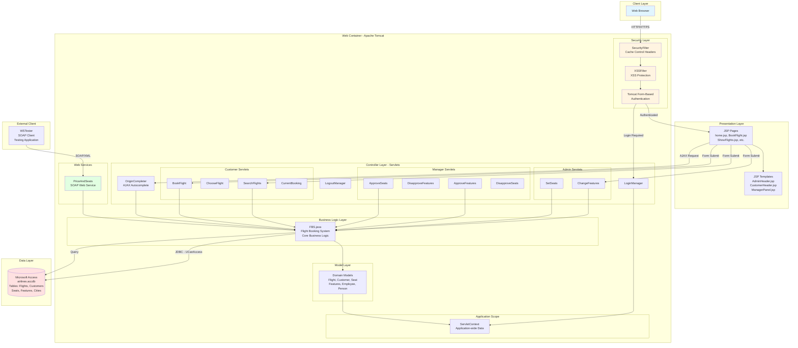
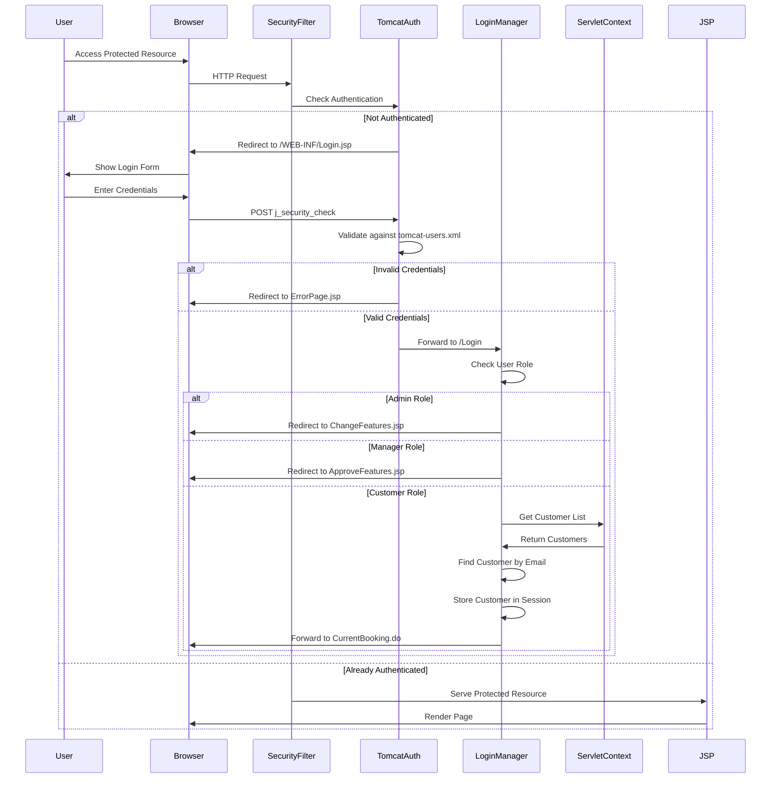
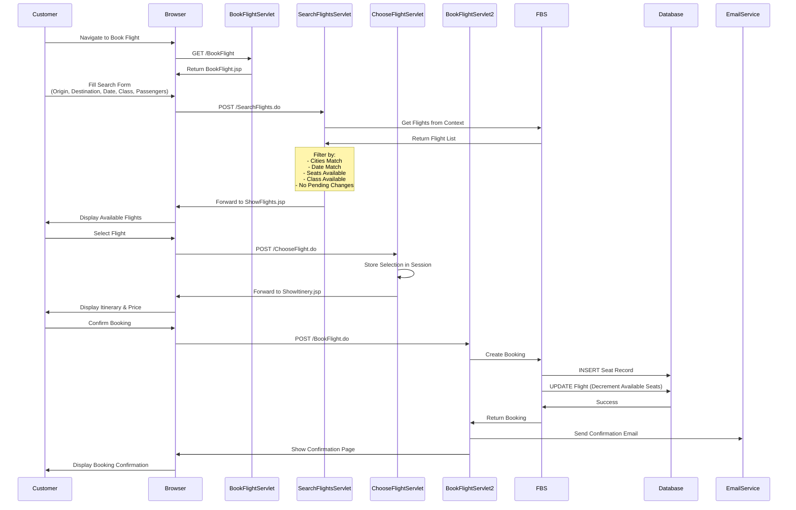
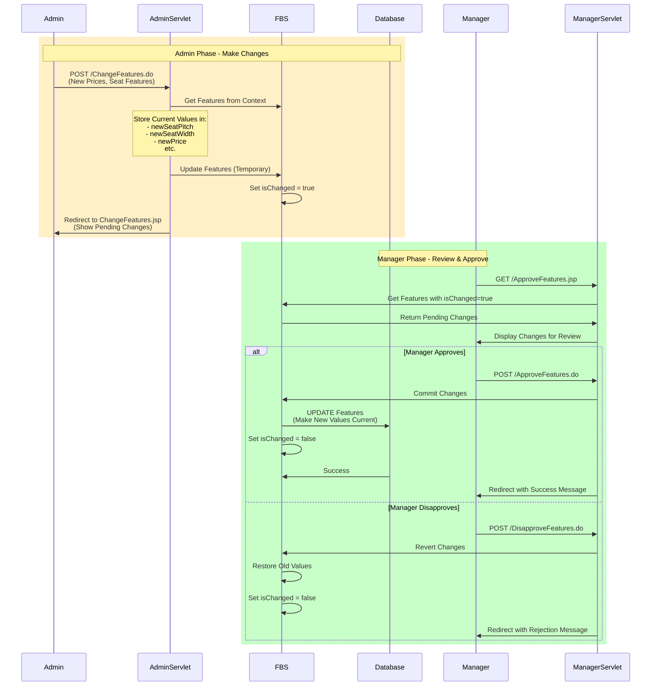
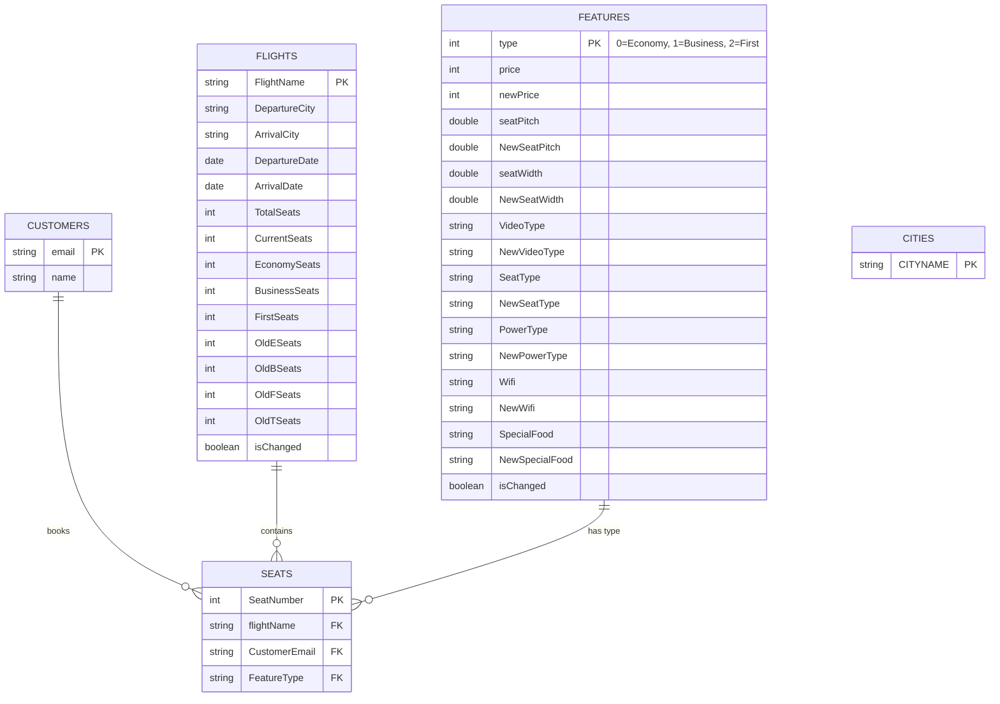
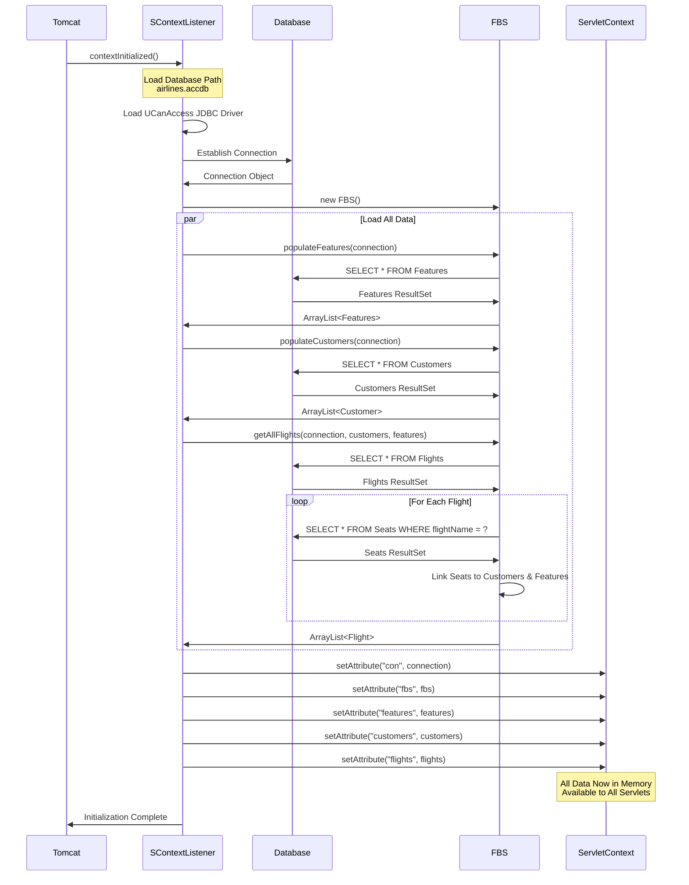
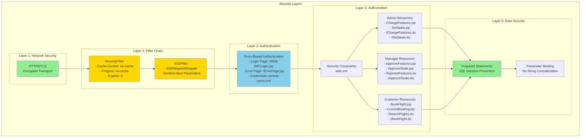
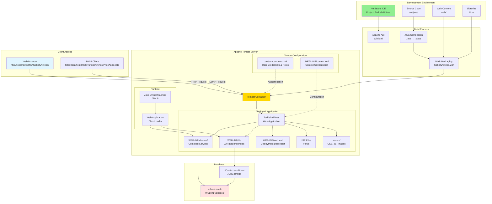
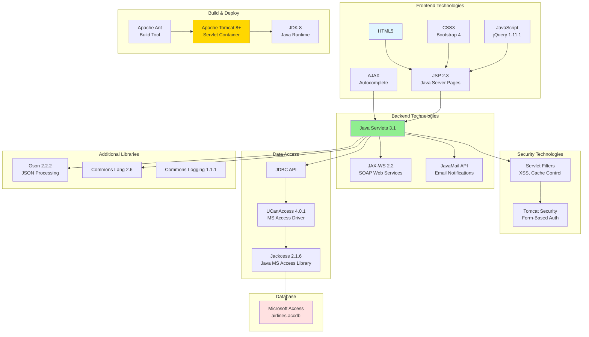

# Flight Booking System - Current Architecture Diagrams

## 1. High-Level System Architecture



## 2. Authentication & Authorization Flow



## 3. Customer Booking Flow



## 4. Admin/Manager Approval Workflow



## 5. Data Model & Relationships



## 6. Application Initialization Flow



## 7. Security Architecture



## 8. Web Services Architecture

```mermaid
graph LR
    subgraph "SOAP Web Service"
        WSServlet[WSServlet<br/>com.sun.xml.ws.transport]
        PriceAndSeats[PriceAndSeats<br/>@WebService]
        
        subgraph "Operations"
            GetPrice[@WebMethod<br/>GetSeatPrice<br/>params: origin, destination<br/>returns: int price]
            GetSeats[@WebMethod<br/>GetAvailableSeats<br/>params: flightNumber, date<br/>returns: int seats]
        end
    end
    
    subgraph "Business Logic"
        FBSStatic[FBS Static Methods<br/>getPrice&#40;origin, destination&#41;<br/>getSeats&#40;flightNumber, date&#41;]
    end
    
    subgraph "Data Access"
        DirectDB[Direct Database Access<br/>New Connection Per Request<br/>UCanAccess JDBC]
        MSAccess[(airlines.accdb)]
    end
    
    subgraph "External Client"
        WSTester[WSTester Project<br/>JAX-WS Client<br/>Generated Stubs]
        WSDL[WSDL<br/>http://localhost:8080/PriceAndSeats?wsdl]
    end
    
    WSTester -->|SOAP Request| WSServlet
    WSServlet --> PriceAndSeats
    PriceAndSeats --> GetPrice
    PriceAndSeats --> GetSeats
    
    GetPrice --> FBSStatic
    GetSeats --> FBSStatic
    
    FBSStatic --> DirectDB
    DirectDB -->|SQL Query| MSAccess
    
    WSTester -.->|Discover| WSDL
    
    style WSServlet fill:#e1ffe1
    style PriceAndSeats fill:#e1ffe1
    style WSTester fill:#ffe1e1
```

## 9. Session & State Management

```mermaid
graph TB
    subgraph "Application Scope - ServletContext"
        Connection[Database Connection<br/>Shared Across All Users]
        FBSInstance[FBS Instance<br/>Business Logic]
        Features[Features List<br/>ArrayList&lt;Features&gt;]
        Customers[Customers List<br/>ArrayList&lt;Customer&gt;]
        Flights[Flights List<br/>ArrayList&lt;Flight&gt;<br/>with Seats]
    end
    
    subgraph "Session Scope - HttpSession"
        subgraph "Customer Session"
            CustomerObj[Customer Object<br/>Current User Info]
            SelectedFlight[Selected Flight<br/>Booking in Progress]
            SearchCriteria[Search Criteria<br/>Origin, Destination, Date]
        end
        
        subgraph "Admin Session"
            AdminUser[Admin User Info]
            PendingChanges[Pending Feature Changes]
        end
        
        subgraph "Manager Session"
            ManagerUser[Manager User Info]
            ReviewQueue[Items to Review]
        end
    end
    
    subgraph "Request Scope"
        FormData[Form Parameters]
        ValidationErrors[Validation Errors]
        SearchResults[Search Results]
    end
    
    Connection -.->|Read Only| CustomerSession
    Connection -.->|Read Only| AdminSession
    Connection -.->|Read Only| ManagerSession
    
    Features -.->|Shared Read| CustomerSession
    Features -.->|Read/Write| AdminSession
    Features -.->|Read/Approve| ManagerSession
    
    Flights -.->|Read/Search| CustomerSession
    Flights -.->|Read/Write| AdminSession
    Flights -.->|Read/Approve| ManagerSession
    
    CustomerObj --> FormData
    SelectedFlight --> FormData
    
    style Connection fill:#ffe1e1
    style Features fill:#e1f5ff
    style Customers fill:#e1f5ff
    style Flights fill:#e1f5ff
```



## 10. Deployment Architecture



## 11. Technology Stack Overview



## Summary

### Key Architectural Characteristics:

1. **Monolithic Architecture**: Single deployable WAR file
2. **MVC Pattern**: JSP (View), Servlets (Controller), Java Models (Model)
3. **In-Memory Data Caching**: All data loaded into ServletContext at startup
4. **Session-based Authentication**: Tomcat form-based authentication
5. **Synchronous Processing**: No async operations or message queues
6. **Single Database Connection**: Shared across all users via ServletContext
7. **Approval Workflow**: Two-phase commit pattern (Admin proposes, Manager approves)
8. **SOAP Web Services**: Legacy XML-based web services
9. **No Caching Layer**: Direct database queries (except initial load)
10. **No Load Balancing**: Single server deployment

### Limitations:

- ❌ Not horizontally scalable
- ❌ No microservices separation
- ❌ Legacy database (MS Access)
- ❌ No API versioning
- ❌ Limited monitoring/observability
- ❌ No containerization
- ❌ No CI/CD pipeline
- ❌ Session-based (not stateless)
- ❌ No real-time updates
- ❌ No mobile app support

